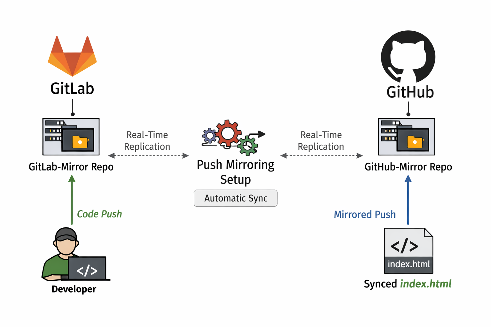
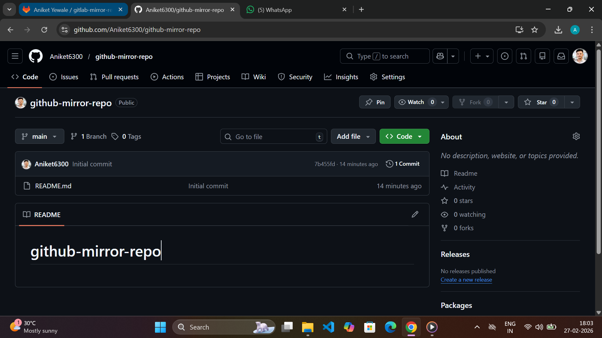
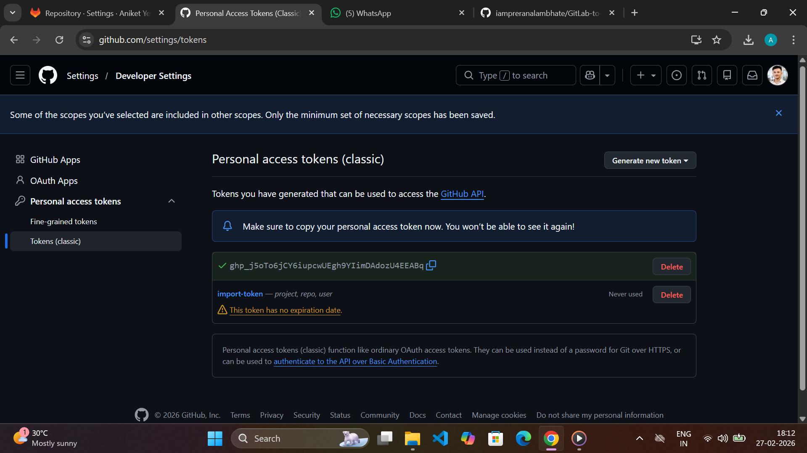
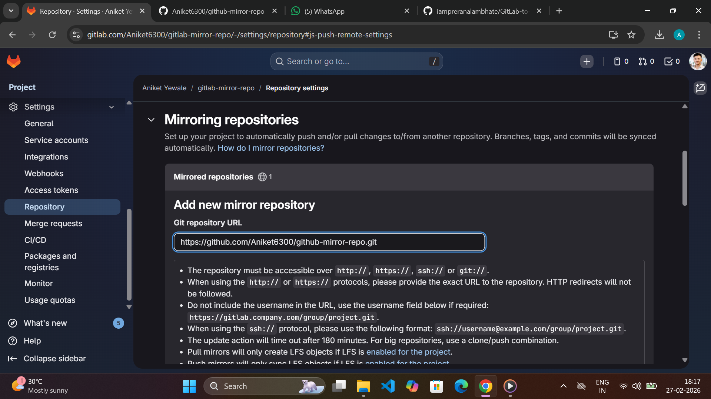
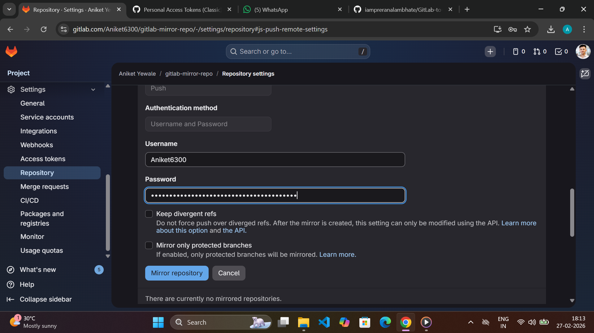
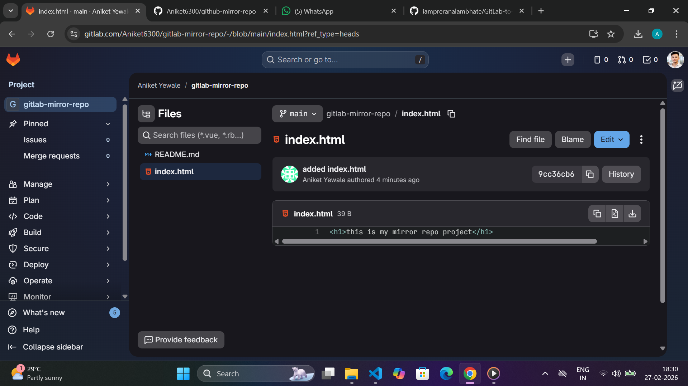
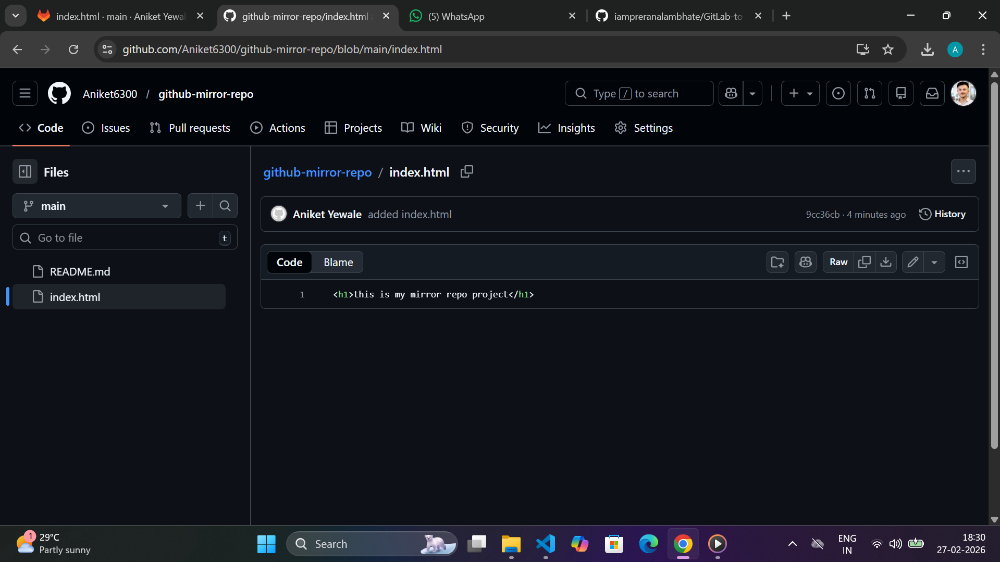

# 🔄 GitLab ↔ GitHub Repository Mirroring

## 📌 Project Overview
This project demonstrates how to configure **repository mirroring between GitLab and GitHub**.  
The goal is to automatically sync code changes pushed to GitLab so that they replicate to GitHub without manual intervention.

---

## 🚀 Objective
- Create repositories on GitLab and GitHub  
- Configure push mirroring from GitLab to GitHub  
- Verify automatic replication of files  
- Demonstrate real-time sync capability  

---
## Architecture Diagram

---

## 🧰 Technologies Used
- Git
- GitLab
- GitHub
- HTML (for testing sync)

---

## 📁 Repository Details

| Platform | Repository Name |
|----------|-----------------|
| GitLab   | `gitlab-mirror-repo` |
| GitHub   | `github-mirror-repo` |

---

## ⚙️ Implementation Steps

### Step 1: Create Repository on GitLab
- Login to GitLab  
- Create new repo: `gitlab-mirror-repo`

### Step 2: Create Repository on GitHub
- Login to GitHub  
- Create new repo: `github-mirror-repo`

### Step 3: Generate GitHub Personal Access Token
- Go to GitHub → Settings → Developer Settings  
- Generate token with **repo access**

### Step 4: Configure Mirroring in GitLab
- Open GitLab repo  
- Go to **Settings → Repository → Mirroring repositories**  
- Add GitHub repo URL

- Select **Push** mirror  
- Enter GitHub username and token 

 
- Save configuration  

### Step 5: Test the Mirroring
- Create `index.html` in GitLab
- Push changes to GitLab
- Verify file appears automatically in GitHub

---

## ✅ Result
✔ Repository mirroring configured successfully  
✔ Changes pushed to GitLab replicated to GitHub  
✔ `index.html` synced automatically 

 
##

---

## 🔍 Use Cases
- Backup repository to another platform  
- Multi-platform code availability  
- Disaster recovery  
- Team collaboration across platforms  

---

## 👨‍💻 Author
**Aniket Yewale**  
📧 aniketyewale626@gmail.com

---

## ⭐ Conclusion
This project successfully demonstrates automated repository mirroring between GitLab and GitHub, ensuring code redundancy and improved workflow automation.